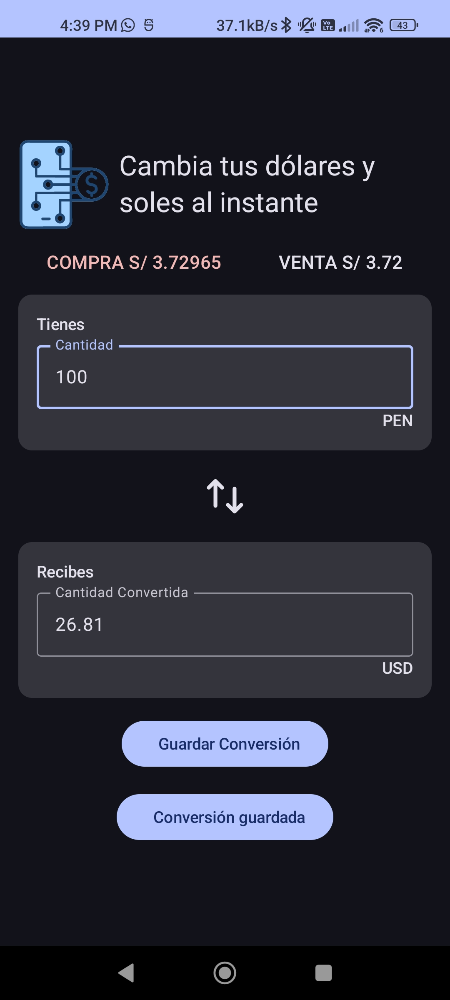
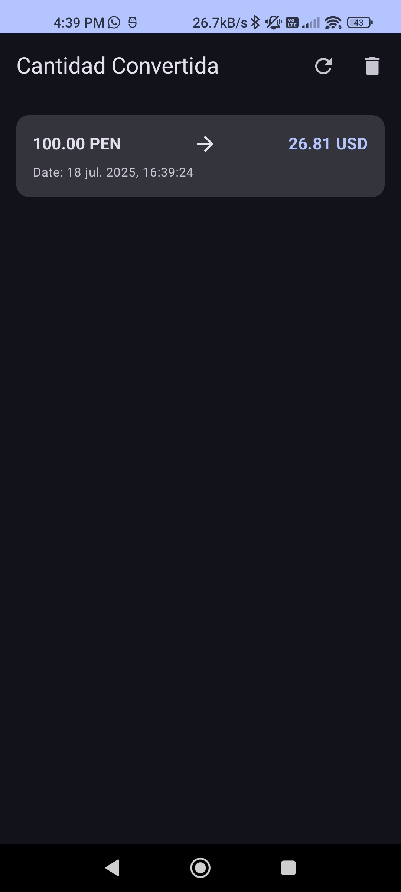

# ExchangeRate App

## Descripción

ExchangeRate es una aplicación Android diseñada para facilitar la consulta de tasas de cambio de divisas y realizar conversiones monetarias. La aplicación permite a los usuarios ver las tasas de compra y venta actuales, convertir montos entre USD y PEN (Soles Peruanos), y guardar un historial de sus conversiones para referencia futura.

El desarrollo de esta aplicación se ha centrado en seguir las mejores prácticas de la industria, implementando una **Arquitectura Limpia** para asegurar un código robusto, mantenible, escalable y fácil de probar.

## Capturas de Pantalla

Aquí puedes ver algunas de las pantallas principales de la aplicación:

**Pantalla de Bienvenida (Splash Screen):**

**Calculadora de Tasas de Cambio:**

**Historial de Conversiones:**

**Historial de Conversiones:**

## Funcionalidades Principales

*   **Pantalla de Bienvenida (Splash Screen):** Una pantalla de inicio animada que mejora la experiencia del usuario al abrir la aplicación.
*   **Calculadora de Tasas de Cambio:**
    *   Muestra las tasas de compra y venta actuales (obtenidas de una API externa).
    *   Permite al usuario ingresar un monto y convertirlo entre USD y PEN.
    *   Funcionalidad para intercambiar las monedas de origen y destino.
    *   Opción para guardar la conversión realizada.
    *   Muestra mensajes al usuario sobre el estado de las operaciones (ej. "Conversión guardada exitosamente").
*   **Historial de Conversiones:**
    *   Muestra una lista de todas las conversiones guardadas por el usuario.
    *   Cada entrada del historial detalla el monto original, la moneda de origen, el monto convertido, la moneda de destino y la fecha de la conversión.
    *   Permite refrescar el historial.
    *   Opción para eliminar todo el historial de conversiones.
    *   Manejo de estados para cuando el historial está vacío o si ocurre un error al cargarlo.

## Arquitectura y Estructura del Proyecto

El proyecto sigue los principios de **Arquitectura Limpia**, dividiendo la aplicación en capas bien definidas para una clara separación de responsabilidades:

1.  **Capa de Presentación (UI):**
    *   Construida con **Jetpack Compose**, el moderno toolkit de Android para interfaces de usuario declarativas.
    *   Utiliza el patrón **MVVM (Model-View-ViewModel)** donde:
        *   **Vistas (Screens):** `SplashScreen`, `ExchangeRateCalculatorScreen`, `ConversionHistoryScreen` son Composables responsables de mostrar los datos y capturar las interacciones del usuario.
        *   **ViewModels:** `ExchangeRateViewModel` y `ConversionHistoryModel` gestionan el estado de la UI, la lógica de presentación y se comunican con los Casos de Uso. Están integrados con Hilt para la inyección de dependencias.
    *   **Navegación:** Gestionada con `Navigation Compose` (`AppNavHost`, `Routes`) para definir y controlar el flujo entre pantallas.
    *   **Estado de la UI:** Se maneja con `StateFlow` en los ViewModels y se observa en los Composables usando `collectAsState()`. Se definen clases `UiState` selladas (ej. `ExchangeRateUiState`, `ConversionHistoryUiState`) para representar los diferentes estados de la pantalla (Loading, Success, Error, Empty).

2.  **Capa de Dominio:**
    *   Contiene la lógica de negocio central y es independiente de cualquier framework específico.
    *   **Modelos de Dominio:** `ExchangeRate`, `ConversionHistory` representan las entidades principales de la aplicación.
    *   **Casos de Uso (Use Cases):**
        *   `GetExchangeRateUseCase`: Lógica para obtener las tasas de cambio.
        *   `SaveConversionUseCase`: Lógica para guardar una conversión.
        *   `GetConversionHistoryUseCase`: Lógica para obtener el historial de conversiones.
        *   `CleanConversionHistoryUseCase`: Lógica para limpiar el historial de conversiones.
        Estos encapsulan una funcionalidad específica y son invocados por los ViewModels.
    *   **Repositorio (Interfaz):** `ExchangeRepository` define el contrato para las operaciones de datos, abstrayendo las fuentes de datos de la capa de dominio.
    *   **Utilidades:** `Resource` (para manejar respuestas de éxito/error de fuentes de datos), `formatTimestamp` (para formateo de fechas).

3.  **Capa de Datos:**
    *   Responsable de la obtención y persistencia de los datos.
    *   **Implementación del Repositorio:** `ExchangeRepositoryImpl` implementa la interfaz `ExchangeRepository`, coordinando entre fuentes de datos remotas y locales.
    *   **Fuente de Datos Remota:**
        *   `ExchangeApiService` (definida con Retrofit) para interactuar con la API externa (`https://mock-8061279c63a34f7c9b7a4869f5f5c69b.mock.insomnia.run/`).
    *   **Fuente de Datos Local (Persistencia):**
        *   **Room Persistence Library:** Utilizada para la base de datos SQLite local.
        *   `AppDatabase`: Define la base de datos.
        *   `ConversionHistoryDao`: Data Access Object para operaciones CRUD sobre la tabla `conversion_history`.
        *   `ConversionHistoryEntity`: Entidad que representa la tabla en la base de datos.
    *   **Mappers:**
        *   `ExchangeRateMapper` (`ExchangeRateMapperImpl`): Convierte objetos de respuesta de la API (`ExchangeRateResponse`) a modelos de dominio (`ExchangeRate`).
        *   `ConversionHistoryMapper`: Convierte entre modelos de dominio (`ConversionHistory`) y entidades de base de datos (`ConversionHistoryEntity`).
    *   **Inyección de Dependencias (Hilt):** `DataModule` provee las dependencias necesarias para esta capa (Retrofit, OkHttpClient, Room Database, DAOs).

## Buenas Prácticas Aplicadas

*   **Kotlin First:** El proyecto está completamente escrito en Kotlin, aprovechando sus características de concisión y seguridad.
*   **Jetpack Compose:** Para una UI moderna, declarativa y eficiente.
*   **Coroutines y Flow:** Para manejar operaciones asíncronas y flujos de datos reactivos de manera eficiente.
*   **Inyección de Dependencias con Hilt:** Para un código desacoplado, fácil de probar y mantener.
*   **Manejo de Estados:** Uso claro de `StateFlow` y clases `UiState` selladas para representar el estado de la UI.
*   **Manejo de Errores:** Uso de la clase `Resource` y `Result` para propagar y manejar errores de forma consistente.
*   **Single Source of Truth (SSOT):** Los ViewModels actúan como la fuente única de verdad para el estado de la UI. El historial de conversiones se obtiene de la base de datos Room.
*   **Modularidad:** Separación clara en capas (presentación, dominio, datos) y dentro de cada capa (ej. ViewModels, Casos de Uso, Repositorios).
*   **Mapeo de Datos:** Uso de Mappers para convertir objetos entre diferentes capas, manteniendo el desacoplamiento.
*   **Pruebas (Potencial):** La arquitectura facilita la implementación de pruebas unitarias (para ViewModels, Casos de Uso, Mappers) y pruebas de instrumentación.
*   **Gestión de Dependencias Centralizada:** Uso de `libs.versions.toml` para una gestión eficiente y organizada de las versiones de las librerías.

## Tecnologías y Librerías Clave

*   **Lenguaje:** Kotlin (`2.0.21`)
*   **UI:** Jetpack Compose (`androidx.compose.bom:2025.07.00`), Material 3 (`androidx.compose.material3:1.4.0-alpha15`), Activity Compose
*   **Arquitectura:** MVVM, ViewModel (`androidx.lifecycle:lifecycle-viewmodel-compose:2.8.3`), LiveData/StateFlow
*   **Networking:** Retrofit (`com.squareup.retrofit2:retrofit:3.0.0`), OkHttp (`com.squareup.okhttp3:logging-interceptor:4.12.0`), Gson
*   **Persistencia de Datos:** Room (`androidx.room:room-runtime:2.7.2`, `androidx.room:room-ktx:2.7.2`)
*   **Inyección de Dependencias:** Hilt (`com.google.dagger:hilt-android:2.57`), Hilt Navigation Compose (`androidx.hilt:hilt-navigation-compose:1.2.0`)
*   **Asincronía:** Kotlin Coroutines (`org.jetbrains.kotlinx:kotlinx-coroutines-android:1.8.0`)
*   **Navegación:** Navigation Compose (`androidx.navigation:navigation-compose`)
*   **Build Tools:** Gradle, Android Gradle Plugin (`8.11.1`), KSP (`2.0.21-1.0.26` para Room y Hilt)
*   **Otras Jetpack:** Core KTX (`androidx.core:core-ktx:1.16.0`)

## Configuración del Proyecto

1.  Clona el repositorio.
2.  Abre el proyecto en Android Studio (versión compatible con AGP `8.11.1`).
3.  El proyecto utiliza una API mock. No se requieren claves API adicionales para la configuración básica.
4.  Construye y ejecuta la aplicación en un emulador o dispositivo físico.

## Posibles Mejoras Futuras

*   Implementación de pruebas unitarias y de instrumentación.
*   Soporte para más divisas.
*   Obtención de tasas de cambio de una fuente de datos en tiempo real más robusta.
*   Personalización de la UI (temas, modo oscuro).
*   Validación de entrada más exhaustiva.

---

Desarrollado por Yoelkill
